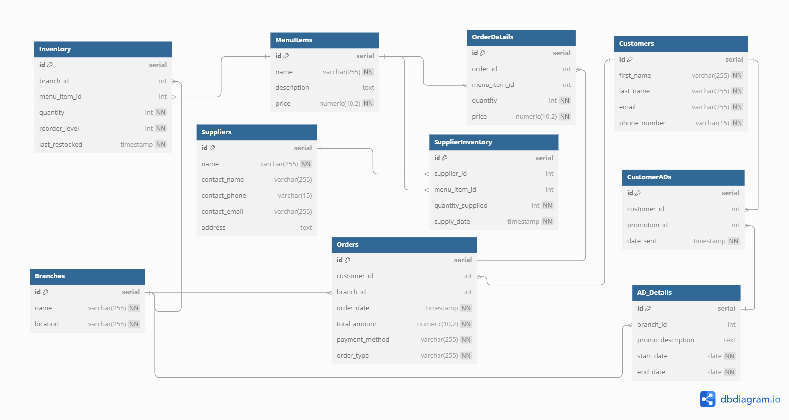
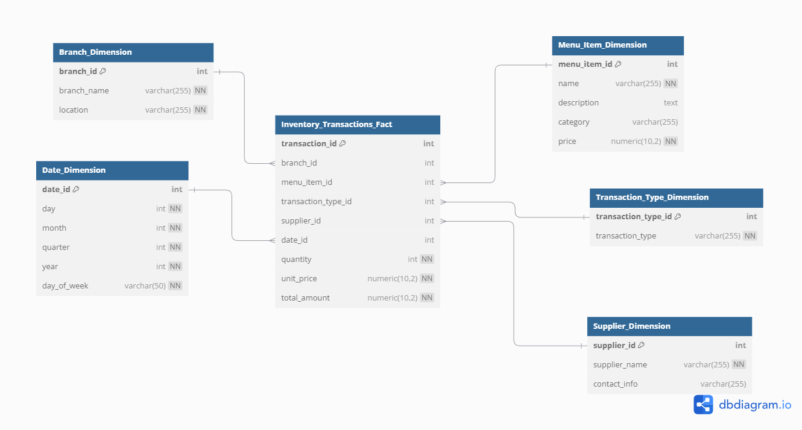

## README: Fufu Republic Inventory and Stock Management Dimensional Model

### Overview
This project presents a solution to address the **Inventory and Stock Management** challenges faced by Fufu Republic, a popular restaurant chain in Nigeria. The solution optimizes inventory levels, tracks stock movements, and improves customer satisfaction by ensuring the availability of popular menu items across branches.

---
I created a database, and then created tables that are neccessary for the tasks, such as; customers, orders, order details, branch, CustomerADs, AD_details, suppliers, supplier inventory, menu-items and inventory.
Here’s how the ERD looks:

---

### Business Challenges Addressed

1. **Inventory Management**: 
   - Track stock levels and avoid stockouts.
   - Identify items that need frequent restocking.
   - Prevent overstocking and reduce waste.

2. **Sales Demand Analysis**:
   - Understand customer demand patterns and their impact on stock.
   - Ensure stock levels are aligned with expected sales trends.

3. **Supplier Management**:
   - Track supplier performance to ensure timely and sufficient restocking.

4. **Customer Satisfaction**:
   - Ensure that popular items are always available by preventing stockouts.

---

### Business Process: **Inventory and Stock Management**

The business process in focus is **Inventory and Stock Management**, which captures stock movements (sales, restocks, and adjustments) and ensures branches are well-stocked with the right items based on demand.

---

### DIMENSIONAL MODEL

The **Dimensional Model** visually represents the relationships between the key entities involved in **Inventory and Stock Management**. It serves as a blueprint for understanding how the **fact table** (which captures stock transactions) is connected to various **dimension tables** (which provide descriptive information for in-depth analysis).

The Model captures the following key relationships:
- **Branches**: Where the stock is managed.
- **Menu Items**: The products being sold and restocked.
- **Transaction Types**: The nature of the stock transaction (sale, restock, or adjustment).
- **Suppliers**: The external vendors responsible for providing stock.
- **Dates**: When transactions occurred to track trends over time.

The diagram showing the relationships between the **fact table** and **dimension tables** looks like this:

It illustrates the **star schema** structure, with the `Inventory_Transactions_Fact` table at the center, linked to multiple dimensions like `Branch_Dimension`, `Menu_Item_Dimension`, `Transaction_Type_Dimension`, and others.

---

### Dimensional Model Design

#### Fact Table: `Inventory_Transactions_Fact`

| Column             | Data Type   | Description                                       |
|--------------------|-------------|---------------------------------------------------|
| transaction_id      | INT         | Primary key                                       |
| branch_id           | INT         | Foreign key to `Branch_Dimension`                 |
| menu_item_id        | INT         | Foreign key to `Menu_Item_Dimension`              |
| transaction_type_id | INT         | Foreign key to `Transaction_Type_Dimension`       |
| supplier_id         | INT         | Foreign key to `Supplier_Dimension` (optional)    |
| date_id             | INT         | Foreign key to `Date_Dimension`                   |
| quantity            | INT         | Number of items added or subtracted               |
| unit_price          | NUMERIC     | Unit price at the time of the transaction         |
| total_amount        | NUMERIC     | Total value of the transaction                    |

---

#### Dimension Tables

1. **Branch_Dimension**:
   Describes the branch where stock transactions occur.

   | Column      | Data Type | Description                  |
   |-------------|-----------|------------------------------|
   | branch_id   | INT       | Primary key                  |
   | branch_name | VARCHAR   | Name of the branch            |
   | location    | VARCHAR   | Branch location               |

2. **Menu_Item_Dimension**:
   Describes the menu items being sold and tracked.

   | Column        | Data Type | Description                 |
   |---------------|-----------|-----------------------------|
   | menu_item_id  | INT       | Primary key                 |
   | name          | VARCHAR   | Name of the menu item        |
   | description   | TEXT      | Description of the item      |
   | category      | VARCHAR   | Category of the menu item    |
   | price         | NUMERIC   | Unit price of the item       |

3. **Transaction_Type_Dimension**:
   Captures the type of transaction (e.g., restock, sale).

   | Column             | Data Type | Description                       |
   |--------------------|-----------|-----------------------------------|
   | transaction_type_id | INT       | Primary key                       |
   | transaction_type    | VARCHAR   | Type of transaction (sale, restock, adjustment) |

4. **Supplier_Dimension**:
   Represents the suppliers responsible for restocking.

   | Column        | Data Type | Description                 |
   |---------------|-----------|-----------------------------|
   | supplier_id   | INT       | Primary key                 |
   | supplier_name | VARCHAR   | Supplier’s name             |
   | contact_info  | VARCHAR   | Supplier’s contact details  |

5. **Date_Dimension**:
   Represents the date of the stock transaction for time-based analysis.

   | Column      | Data Type | Description                 |
   |-------------|-----------|-----------------------------|
   | date_id     | INT       | Primary key                 |
   | day         | INT       | Day of the month            |
   | month       | INT       | Month of the year           |
   | quarter     | INT       | Quarter of the year         |
   | year        | INT       | Year                        |
   | day_of_week | VARCHAR   | Day of the week             |

### Conclusion

This **Inventory and Stock Management Dimensional Model** addresses the critical challenges faced by Fufu Republic in managing inventory across branches. By using the ERD as a guide, this solution helps visualize relationships between stock transactions and key entities like branches, menu items, and suppliers. The model offers actionable insights to optimize restocking, minimize waste, and ensure that popular items are always available to enhance customer satisfaction.
